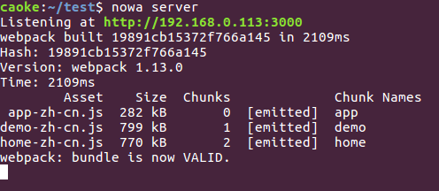

# 本地开发

---

## 使用

可以通过 `nowa server` 命令来开启一个本地开发调试服务器。

> 如果提示找不到 server 命令，请通过 `nowa install server` 来安装

```shell
nowa server
```

该命令必须使用在通过 `nowa init` 创建的项目中，请在项目根目录下执行。

也可通过快捷命令 `npm start` 来完成同样的工作。



## 参数

`nowa server` 接受以下候选参数：

- `-s, --src <dir>` 源代码目录，默认指向 `src`
- `-d, --dist <dir>` 输出代码目录，默认指向 `dist`
- `-p, --port <port>` 服务器监听端口，默认指向 `3000`
- `-e  --entry <file>` 应用入口文件，默认指向 `app/app.js`
- `    --pages` 开启多页面入口规则
- `    --vars` 运行时环境变量（详见[环境变量篇](huan_jing_bian_liang.md)）
- `    --buildvars` 构建时环境变量（详见[环境变量篇](huan_jing_bian_liang.md)）
- `-r, --proxy` 开发服务器的资源代理设置
- `-k, --keepcss` 实时输出 css 文件到 dist 目录
- `-l, --lazyload` 禁用变更的实时推送
- `-h, --https` 开启 https 服务器
- `    --externals` webpack 外部变量定义
- `-o, --loose` 使用 babel es2015 的宽松模式来做代码转换

