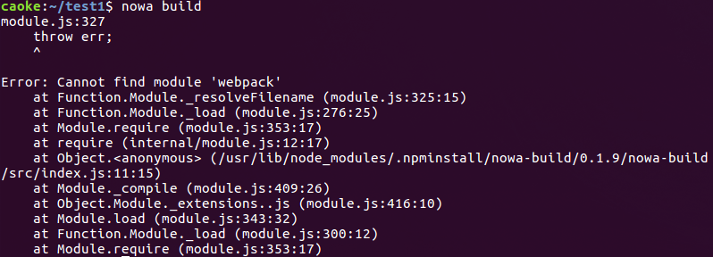

# 常见问题

---

## 1. 模块丢失 `Error: Cannot find module 'xxx'`

如图



一般是由于上次 npm 安装异常中止导致，可通过卸载后重新安装 nowa 工具来解决。  

```shell
rm -rf `npm root -g`/nowa-* ~/.nowa
nowa install --registry=https://registry.npm.taobao.org
```
