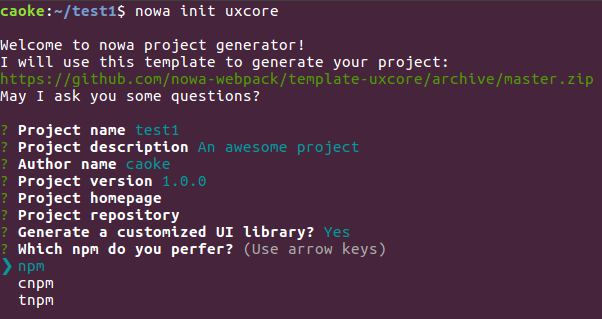

# 新项目

---

## 使用

可以通过 `nowa init <url>` 命令来做项目初始化的操作。

> 如果提示找不到 init 命令，请通过 `nowa install init` 来安装

```shell
nowa init https://github.com/nowa-webpack/template-uxcore/archive/v2.zip
```

`<url>` 为项目模板 zip 包下载地址或下载地址的快捷命令，例如可以通过快捷命令达到和以上命令同样的效果：

```shell
mkdir test && cd test
nowa init uxcore
```

目前内置了以下快捷映射：

`h5`、`salt` => `https://github.com/nowa-webpack/template-salt/archive/master.zip`

`web`、`uxcore` => `https://github.com/nowa-webpack/template-uxcore/archive/v2.zip`

当回答完一些必要的问题之后，脚手架会开始自动生成和初始化项目。



等待初始化完毕后，便可直接通过 `nowa server` 或 `npm start` 来启动开发服务器。

## 参数

`nowa init` 在初始化新项目时，接受以下候选参数：

- `-f, --force` 是否强制更新模板
  如果不给出 `force` 参数，模板将在本地缓存 24 小时，在 24 小时后的第一次执行时自动检查并下载更新
- `-a, --as` 模板路径的别名
  如果指定了模板路径的别名，则下次可通过模板路径别名替代完整的模板路径来初始化项目  
例如：
```shell
nowa init https://github.com/nowa-webpack/template-uxcore/archive/master.zip -a ux
```

第二次可使用以下命令有同样的效果：
```shell
nowa init ux
```


