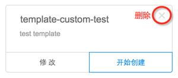
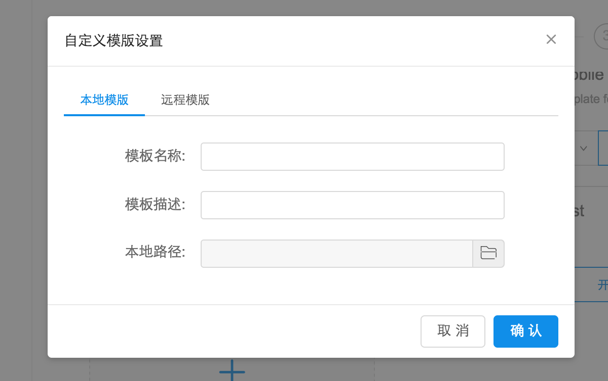

## 自定义本地脚手架

---

官方脚手架不多，用户可以根据 nowa 的[脚手架教程](https://nowa-webpack.github.io/docs/jiao_shou_jia.html)开发脚手架。

那么如何导入本地的自定义脚手架呢？

1、用户可以在创建页面点击 '添加自定义脚手架'的卡片

2、选择'本地脚手架'

3、填写脚手架的必要信息

提交之后创建页面会出现用户的自定义的本地脚手架。后面的流程与[创建项目](https://nowa-webpack.github.io/nowa/chuang_jian_xiang_mu.html) 一样。

<!--插图 -->