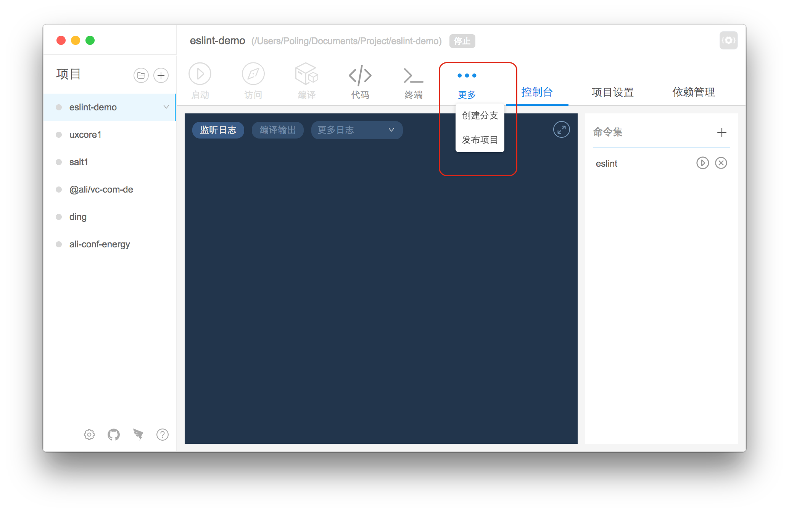

## 插件安装管理 (1.8.*)

---

在这里可以安装插件到全局目录下。

#### 入口

#### 页面

此页面操作类似依赖管理功能，不过是它的弱化版本。

所有的更新都是红色按钮提示。

用户安装组件之后可以重新安装组件。

#### 命令行式组件

该类型组件可以通过命令行启动，没有界面，比如 `nowa-eslint`。

#### UI式组件

该类型无法通过命令行启动，安装之后需要重启工具才能使工具生效。

安装工具之后，会在项目基础操作区出现 `更多`按钮，hover 上去会显示该组件。

点击该组件，会弹出一个提问窗口，用户输入回答，组件会接受这些回答去执行一些操作。

目前UI式组件接口已经开放，可以看下一节。

