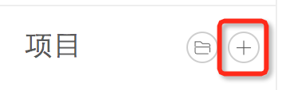
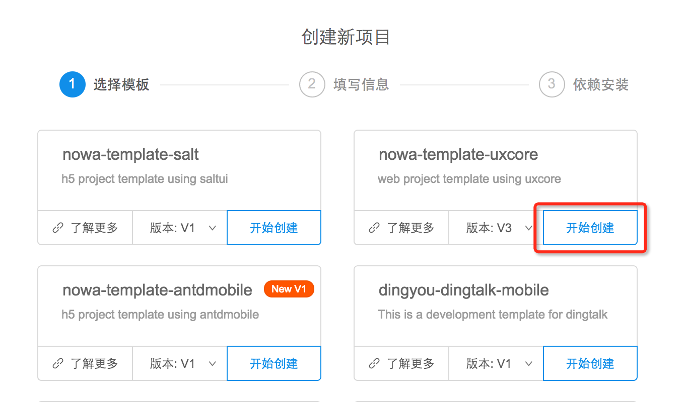
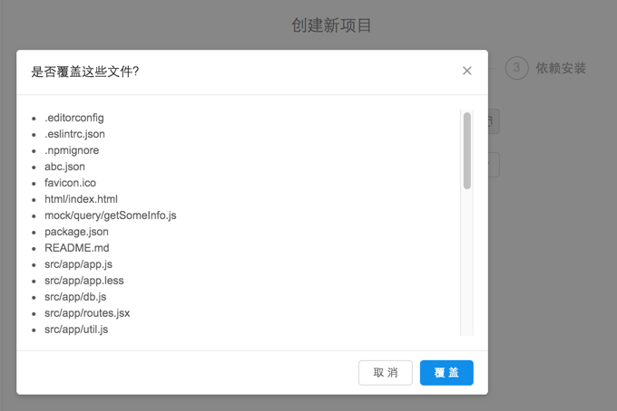
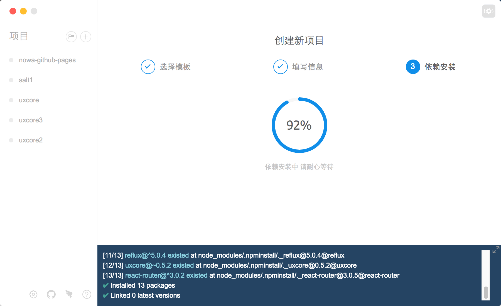

## 创建项目

---

#### 入口

1.在项目详情页点击 '＋' 按钮导入

2. 在欢迎页点击 '创建' 按钮导入

请戳[初始化](https://nowa-webpack.github.io/nowa/chu_shi_hua.html)查看详情。

#### 三步曲

1. 请选择中意合适的模板

官方模板下自带文字解释说明，请选择适合自己场景的模板。比如示例目前选择了 'uxcore'。

2. 创建设置

路径后边的文件夹图标可以设置存放项目的目录，最后一级填写项目文件夹名字，默认作为项目名。

请选择合适自己的源，如果不是含有私有模块的项目，内陆用户请选择taobao源。详情查看[源策略](https://nowa-webpack.github.io/nowa/gong_ju_she_zhi.html)第4道。

如果新填写的路径已经存在的话，会弹出提示框提示已经存在的项目文件，可以选择覆盖安装，或者取消之后重新填写路径。

提交表单后，工具会安装相关依赖。

3. 静静等待安装

根据自身网络情况，等待时间因机子而异，稍安勿躁。安装采用的源是第二步用户选择 npm 源，如果不想作死，请根据实际情况选择源。

安装结束后，开启项目新人生。

请看视频小解

<!--视频 -->

您觉得创建方式不太对，请到[这里](https://github.com/nowa-webpack/nowa-gui/issues/new)提意见～

