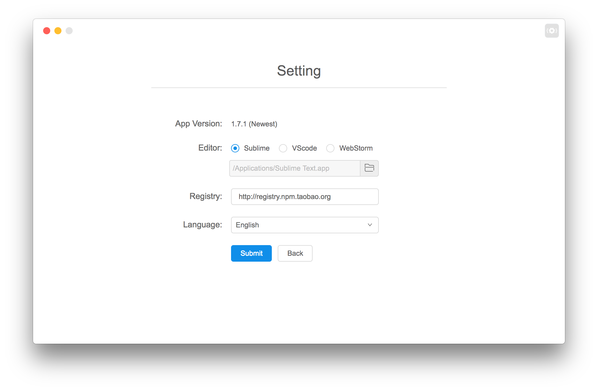

## 工具设置

---

入口处:

设置页面:

<!--插图 -->

#### 1. 项目版本

如果有新版本，会在右侧出现更新按钮

#### 2. 编辑器

目前支持三种编辑器，'Sublime' & 'VScode' & 'WebStorm'。

windows & linux用户请选择到可执行文件，mac 用户请选择到应用。

如果用户使用的不是以上三种编辑器，可以在 'VScode' & 'WebStorm' 里面的路径选择里尝试下选择到自己喜欢的编辑器，如果一个都无法运行，那么十分抱歉了。 /(T.T)\

#### 3. 中英文

其实英文是用来装逼用的。

#### 4. npm 源

源策略是工具的重点内容。

在这里设置的是全局的源地址，当项目没有设置源，会采用全局的源设置。建议用户安装工具之后直接先来设置页面设置源。

如果用户没有设置源，那么工具会采用默认源作为全局源。

源策略的优先级为：项目源 > 全局源 > 默认源。

源列表目前列出了 npm, taobao, alibaba 三个源，非阿里用户请不要尝试使用此源，不然安装项目更新依赖都会失败。

如果用户使用的是私有源，可以在此添加私有源地址。

#### 5. 重置按钮

点击该按钮，会删除用户所有与 nowa 有关的数据然后重启。

实际删除的是用户目录下的 `.nowa-gui` 文件达到清除数据的目的。

