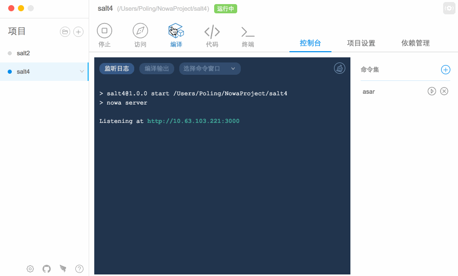
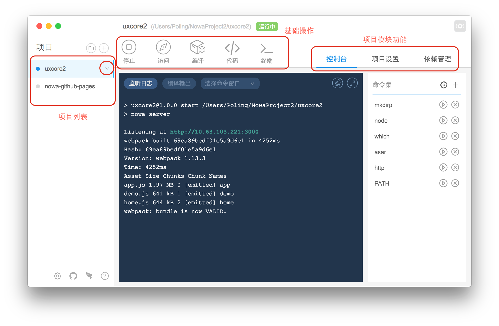

## 基础操作

---

请看视频演示基础操作，如果想看笔者唠嗑请继续往下拉。

<!--视频 -->

文字解说：

<!--插图 -->

#### 1、删除项目

选中项目后，项目列表尾部会出现向下剪头。

当用户点击箭头之后，会出现'删除项目'的选项。点击该像，弹窗二次提醒用户删除项目。

删除项目只是从工具中移除项目，不会真的进行物理操作从磁盘中删除该项目，请用户放心。

#### 2、打开项目文件夹

1. 请在左侧项目列表中选中项目
2. 请点击向下按钮
3. 请点击 '打开文件夹'

#### 3、使用编辑器打开项目

如果没有设置编辑器，请查看[如何设置编辑器](https://nowa-webpack.github.io/nowa/gong_ju_she_zhi.md)。

点击大大的 '代码' 按钮即会出现编辑器。

采用外接编辑器的做法是因为省时省力省心。

#### 4、打开项目终端

在项目目录下唤起终端。

#### 5、启动项目

如果是 nowa 项目，那么'启动'项目之后，会解锁'访问'功能。用户可以直接点击该按钮看到浏览器出现这个页面。

如果是非 nowa 项目，且用户在 `package.json` 中连 'start' 都没写的话，这个功能就是废的。

其实这个功能就是帮助用户执行 `npm start`。

#### 6、编译项目

其实这个功能就是帮助用户执行 `npm run build`。

