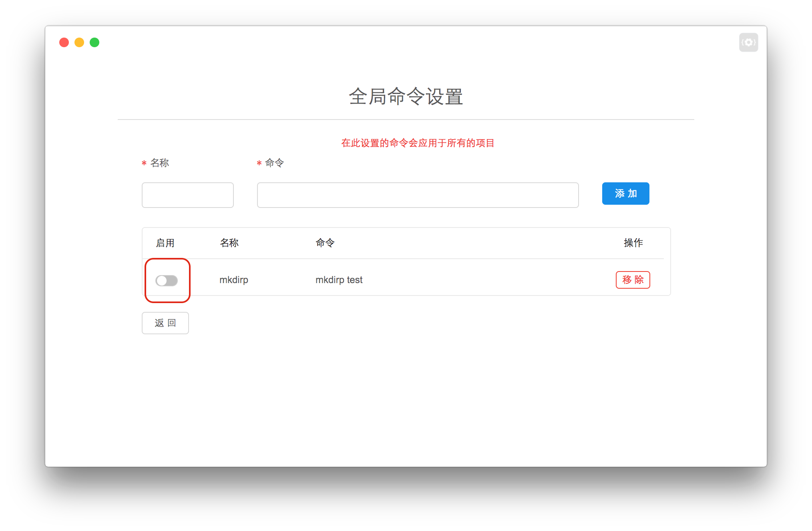

## 全局设置命令

---

在这里可以配置全局默认命令，可以应用于所有项目的命令集中。

#### 入口

#### 页面

当用户启动 "应用" 命令后，当前导入的项目的命令集都会添加这个命令。如果项目中已经有命令名字与其同名，全局命令不会覆盖项目本身的命令。

当用户关闭 "应用" 命令后，每个项目中的命令集里的全局命令会被删除。

当用户确认移除命令之后，每个项目中的命令集里的全局命令会被删除，表格中的命令会被删除。

