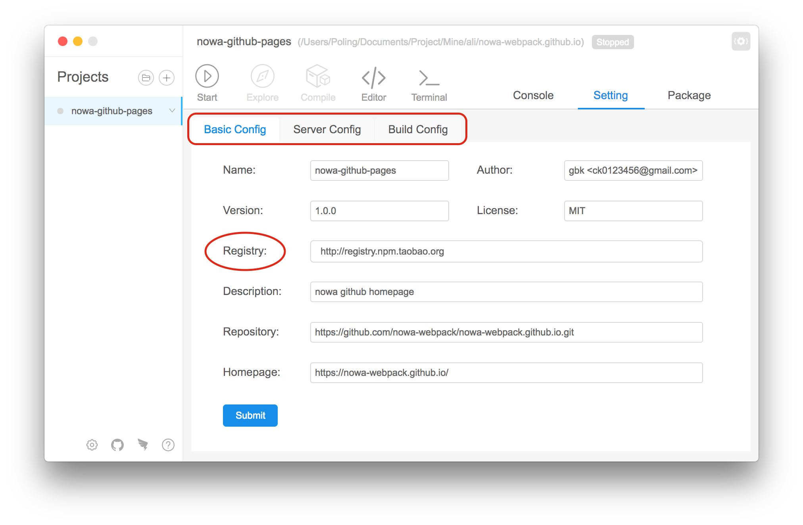

##  项目设置

---

#### 基本设置

该面板主要设置的是 `package.json` 文件。

里面的字段除 'Registry' 外都会修改物理文件。

#### 开发配置

该面板主要设置的是 `abc.json` 文件。仅适用于 nowa 项目。

这里面的字段都与开发环境配置有关，即影响的是 '启动' 任务。

如果用户启动了该项目，同时又修改了这个面板的字段。那么项目会先停止，然后重新启动以便适用新配置。

#### 编译配置

该面板主要设置的是 `abc.json` 文件。仅适用于 nowa 项目。

这里面的字段都与生产环境配置有关，即影响的是 '编译' 任务。

如果觉得您对配置项内容不了解的话，可以点击面板的右上方的 '问号' 按钮进行查看每一项的说明。

#### abc.json

每个 nowa 项目中都会包含这个文件，这个文件是 nowa 项目的配置文件。

关于 'abc.json' 具体的项目配置说明，用户可以参考命令行版本的[本地开发](https://nowa-webpack.github.io/docs/ben_di_kai_fa.html)。

用户可以添加 'webpack.config.js' 对 nowa 默认的 webpack 项进行覆盖，具体请参考[覆盖默认的 webpack 配置](https://nowa-webpack.github.io/docs/fu_gai_mo_ren_de_webpack_pei_zhi.html)。

如果您觉得可视化工具对 nowa 的配置项缺少的话，可以到[这里](https://github.com/nowa-webpack/nowa-gui/issues/new)提意见～

