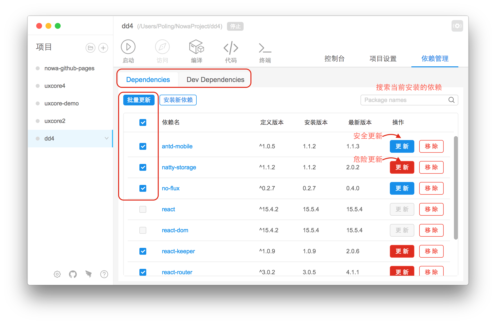
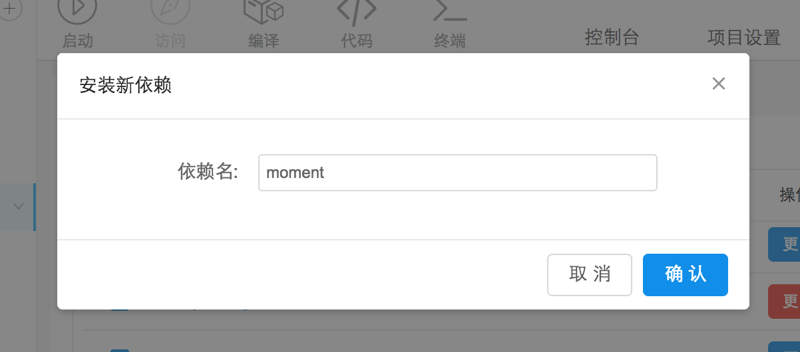

##  依赖管理

---

<!--插图 -->

依赖管理根据 `package.json` 里面的依赖字段分为 'Dependencies' 和 'Dev Dependencies'。

#### 字段声明
依赖以表格的形式呈现。

* `定义版本` 指的是 `package.json` 里的依赖版本定义
* `安装版本` 指的是实际在 `node_modules` 文件夹里面的安装依赖版本
* `最新版本` 指的是源地址上的最新版本

#### 操作说明

1、更新

'更新' 操作分为 '安全更新'(蓝色) 和 '危险更新'(红色)。
 
* `安全更新` 指的是 'minor' 和 'patch' 位更新，更新之后不会影响组件使用
* `危险更新` 指的是 'major' 位更新，更新之后可能影响组件使用

另外，如果有多个组件想要同时更新，可以选中选择框，然后点击 '批量更新'。

2、移除

'移除' 操作实际是执行 `npm uninstall <packageName>`, 会物理移除依赖，所以请谨慎使用。

3、新增

请点击 '安装新依赖' 按钮，工具会弹窗提示用户。输入依赖名字，确认即可安装。

