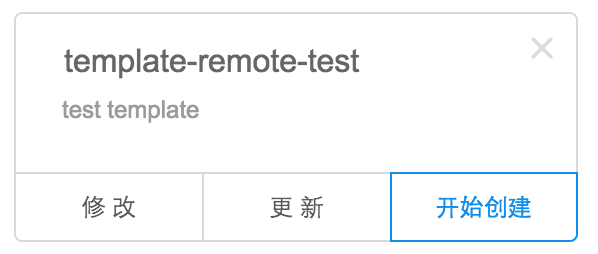
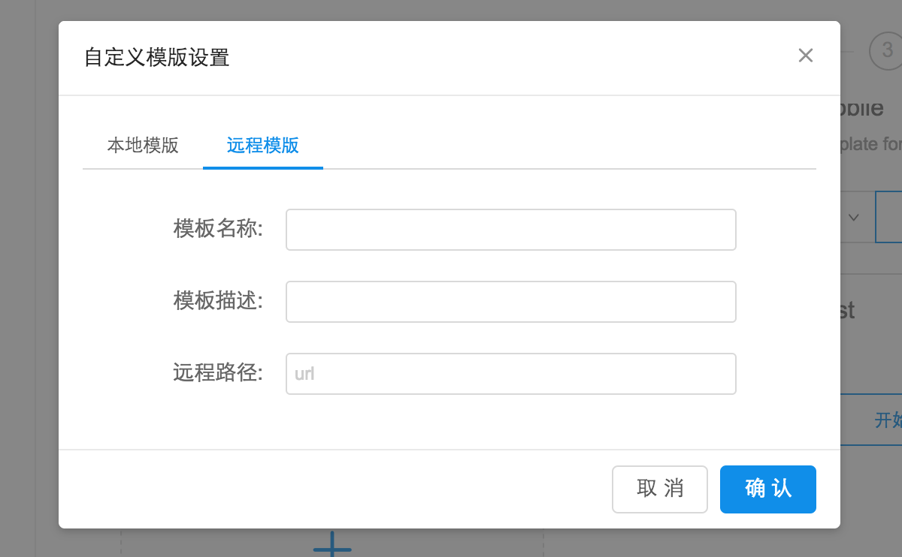

## 自定义远程脚手架

---

当本地的脚手架需要分享给同伴使用的时候，可以讲本地脚手架升级为远程脚手架供同伴使用。

步骤：

1、请上传脚手架到 github

把本地脚手架的文件夹上传到github，得到 download zip 地址。

比如 `https://github.com/nowa-webpack/template-salt/archive/master.zip`

2、用户可以在创建页面点击 '添加自定义模板' 的卡片

<!--插图 -->

3、选择'远程模板'

4、填写脚手架的必要信息

提交之后创建页面会出现用户的自定义的本地脚手架。后面的流程与[创建项目](https://nowa-webpack.github.io/nowa/chuang_jian_xiang_mu.html) 一样。

提交的远程脚手架有更新的话，可以点击更新按钮使本地缓存的脚手架更新。

